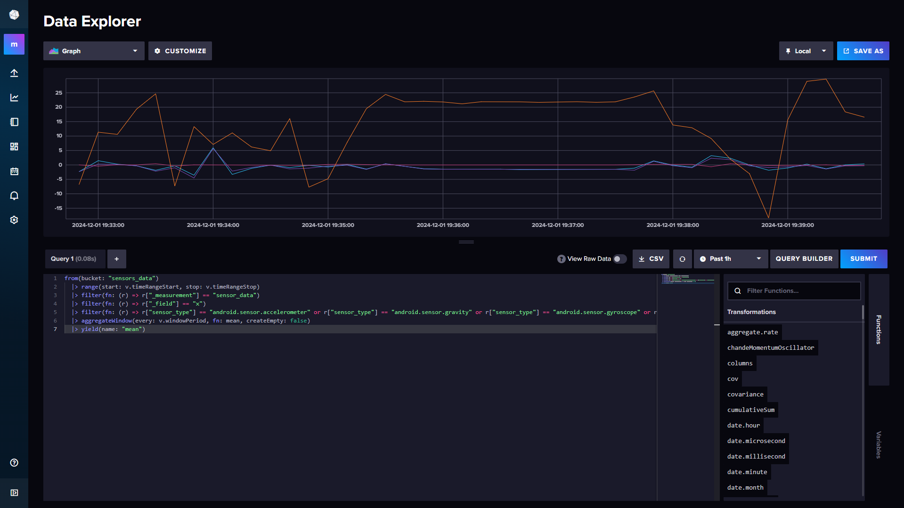

# IoT Sensors Streaming

## Overview

This project is a real-time streaming, storage, and visualization system for sensor data. It leverages **Kafka** for data streaming, **InfluxDB** (time-series database) and **MongoDB** (NoSQL database) for storage, and **Grafana** for visualization. Sensor data is captured using the [SensorServer app](https://github.com/umer0586/SensorServer) and streamed to Kafka. Consumer APIs for each database handle data ingestion and storage, with the system being fully containerized and orchestrated using **Docker Compose**.

---

## System Diagram

This diagram provides an overview of the system's components and data flow.


---

## Features

### 1. **Real-Time Sensor Data Collection**
- Data is collected from smartphone sensors (Accelerometer, Gyroscope, Magnetic field, Gravity) using the [SensorServer app](https://github.com/umer0586/SensorServer).
- Sensor data is transmitted via **WebSocket** from the phone to a Kafka producer.

### 2. **Data Streaming and Processing**
- **Kafka** acts as the message broker, streaming data to designated topics for InfluxDB and MongoDB.
- The system supports two databases:
  - **InfluxDB**: Specialized for time-series data storage and includes native visualization capabilities.
  - **MongoDB**: Stores unstructured sensor data flexibly.

### 3. **Consumer APIs**
- **Flask**-based APIs consume data from Kafka and store it in respective databases:
  - **InfluxDB Consumer API**:
    - Handles data sent to InfluxDB.
  - **MongoDB Consumer API**:
    - Handles data sent to MongoDB.
- **Flask-SocketIO** is used to send log messages to the frontend, such as:
  - Starting/Stopping the pipeline.
  - Logs of data written to the database.

### 4. **Interactive Frontend**
- Both APIs provide a browser-based interface for pipeline management:
  - Start/stop data pipelines.
  - Configure database credentials and settings.

### 5. **Visualization**
- **InfluxDB**'s built-in visualization tools offer quick insights into time-series data.
- **Grafana** supports advanced dashboards, integrating both MongoDB and InfluxDB for custom visualization.

### 6. **Portability and Scalability**
- The system is containerized, with all services defined in a `docker-compose.yml` file.
- APIs are pushed to Docker Hub, allowing deployment across various environments.

---

## Repository Structure

```
APIs_Requests/
  influxdb_consumer_api.py             # Scripts to interact with the InfluxDB consumer API via `requests` library
  mongodb_consumer_api.py              # Scripts to interact with the MongoDB consumer API via `requests` library
Query_DBs/
  query_influxdb.py                    # Script for querying InfluxDB
  query_mongodb.py                     # Script for querying MongoDB
assets/
  GIF.gif                              # Real-Time Visualization of sensor data
  UML_Diagram.png                      # System architecture diagram
  Grafana_Visualization.png            # Grafana dashboard visualization
  InfluxDB_Visualization.png           # InfluxDB dashboard visualization
  screenshot_influxdb_consumer_app.png # Screenshot of the InfluxDB Consumer App
  screenshot_mongodb_consumer_app.png  # Screenshot of the MongoDB Consumer App
influxdb_consumer_api/
  templates/                           # HTML templates for InfluxDB Consumer API interface
  Dockerfile                           # Dockerfile for the API
  app.py                               # Flask API for InfluxDB Consumer
  producer.py                          # Kafka producer for InfluxDB
  requirements.txt                     # Dependencies for InfluxDB Consumer API
mongodb_consumer_api/
  templates/                           # HTML templates for MongoDB Consumer API interface
  Dockerfile                           # Dockerfile for the API
  app.py                               # Flask API for MongoDB Consumer
  producer.py                          # Kafka producer for MongoDB
  requirements.txt                     # Dependencies for MongoDB Consumer API
RealTime_visual_sensors_data.py        # Script for visualizing sensor data in real time
docker-compose.yml                     # Docker Compose file for orchestration
requirements.txt                       # Project dependencies
```

---

## Setup and Configuration

### Prerequisites
1. **SensorServer App**:
   - Install and configure the [SensorServer app](https://github.com/umer0586/SensorServer) on your smartphone(Android Only) to stream sensor data via WebSocket.

2. **Docker**:
   - Ensure that Docker is installed and running on your system. Install Docker from [here](https://www.docker.com/products/docker-desktop).

3. **Python**:
   - This project uses Python version 3.12.6. Install Python from [here](https://www.python.org/downloads/).

---

### Configuration Steps

#### 1. **Clone the Repository**
Clone the repository to your local machine:
```bash
git clone https://github.com/TouradBaba/IoT_sensors_streaming.git
cd IoT_sensors_streaming
```

#### 2. **Create a Virtual Environment**
It's recommended to create a virtual environment to manage the Python dependencies for the project:
```bash
python -m venv myenv
```
Activate the virtual environment:
- On Windows:
  ```bash
  myvenv\Scripts\activate
  ```
- On macOS/Linux:
  ```bash
  source myenv/bin/activate
  ```

#### 3. **Install Python Dependencies**
Install the required Python dependencies:
```bash
pip install -r requirements.txt
```

#### 4. **Start Docker**
Make sure Docker is installed and running on your system.

#### 5. **Starting the System**
Run the following command to launch the system:
```bash
docker-compose up --build
```

#### 6. **InfluxDB**
- Access the InfluxDB dashboard at [http://localhost:8086](http://localhost:8086) after starting Docker Compose.
- Default credentials:
  - Username: `admin`
  - Password: `admin12345`
- Create an **API Token**:
  - Navigate to **InfluxDB CLI → Initialize Client → Copy the Token**.
  - Use this token in the InfluxDB Consumer API configuration.

#### 7. **MongoDB**
- MongoDB uses the default database (`sensor_data`) and collection (`sensor_data`).
- No additional configuration is required.

#### 8. **APIs**
- APIs are accessible via localhost as configured in the `docker-compose.yml` file.
  - **InfluxDB Consumer API**:
    - Access the InfluxDB Consumer App at [http://localhost:5000](http://localhost:5000).
  - **MongoDB Consumer API**: 
    - Access the MongoDB Consumer App at [http://localhost:5001](http://localhost:5001). 
- You can also interact with the APIs using scripts located in the `APIs_Requests/` directory.

#### 9. **Grafana**
- Access Grafana at [http://localhost:3000](http://localhost:3000).
- Add data sources:
  - **InfluxDB**: Configure it with the credentials and token created earlier.
  - **MongoDB**: Use the **MongoDB Data Source Plugin**.
- Create dashboards with custom visualizations.

---

## Workflow

1. **Starting the Pipeline**:
   - When a pipeline is started in a given consumer API (InfluxDB or MongoDB), the API first calls the **Kafka Producer**.
   
2. **Data Collection**:
   - The **Kafka Producer** retrieves real-time sensor data from the **SensorServer** app, which streams data via **WebSocket**.

3. **Data Streaming**:
   - The data from the phone's sensors is sent to the corresponding **Kafka topic** (`sensor-data-influxdb` for InfluxDB or `sensor-data-mongodb` for MongoDB).

4. **Data Storage**:
   - The API then consumes data from the Kafka topic. The data is processed and then stored in the respective database (**InfluxDB** or **MongoDB**).

---

## Querying the Databases and Real-Time Visualization

The **Query_DBs** and **APIs_Requests** folders contain scripts that enable interaction with the databases and consumer APIs:

- **Query_DBs**:
  - The scripts `query_influxdb.py` and `query_mongodb.py` allow you to query the data stored in **InfluxDB** and **MongoDB**, respectively.
  
- **APIs_Requests**:
  - The scripts `influxdb_consumer_api.py` and `mongodb_consumer_api.py` enable you to interact with the Flask-based APIs to start/stop the pipeline.

The **RealTime_visual_sensors_data.py** is for visualizing sensor data in real time. It allows you to directly monitor the sensor data streamed from the SensorServer.

---

## Demonstration

### Real-Time Visualization of Sensor Data


### InfluxDB Consumer API Interface


### MongoDB Consumer API Interface


### Grafana Visualization


### InfluxDB Visualization



---

## Acknowledgement

I would like to acknowledge **[Umer Farooq](https://github.com/umer0586)** for developing the **SensorServer** app, which was used to collect smartphone sensor data.


